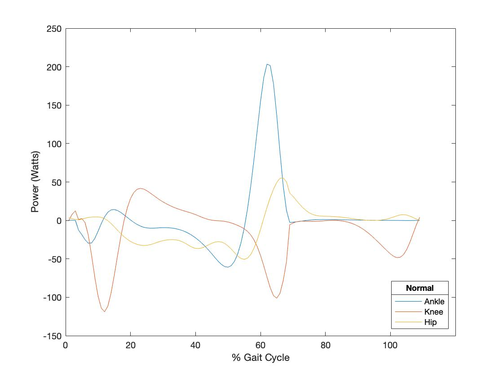
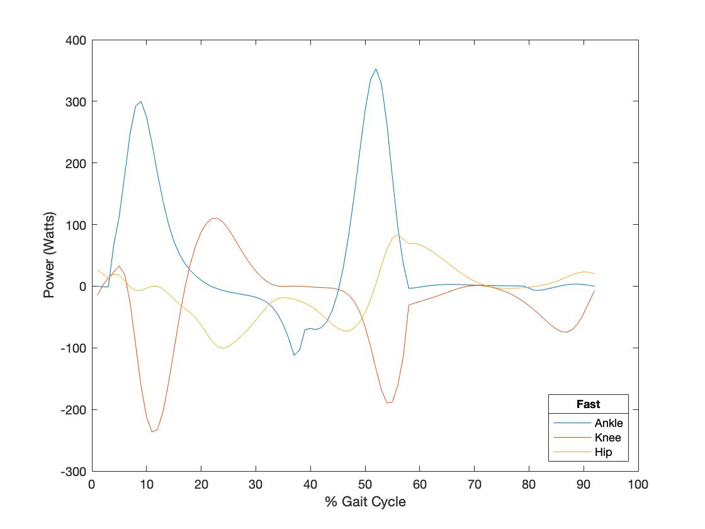

# Inverse Dynamics Analysis
The scripts in this repository calculate inverse dynamics from analog and marker position data.. You can read my lab report for this analysis by clicking on the [Lab03_Jason_Dude.pdf](Lab03_Jason_Dude.pdf) file. 

The [jdmodel.m](jdmodel.m) is the main script file. This file loads the data, creates a data summary and creates the plots that are depicted below. The plots show the power and moments of the ankle, knee, and hip during one complete gait cycle during normal and fast walking speeds of one participant. The [dataSummary.m](dataSummary.m) function assigns markers to anatomical joints and calculates segment angular velocities and accelerations, joint angular velocities, center of mass acceleration for each segment, mass and inertia terms, stride length, cadence, and joint power.

<!-- .element height="50%" width="50%" -->

