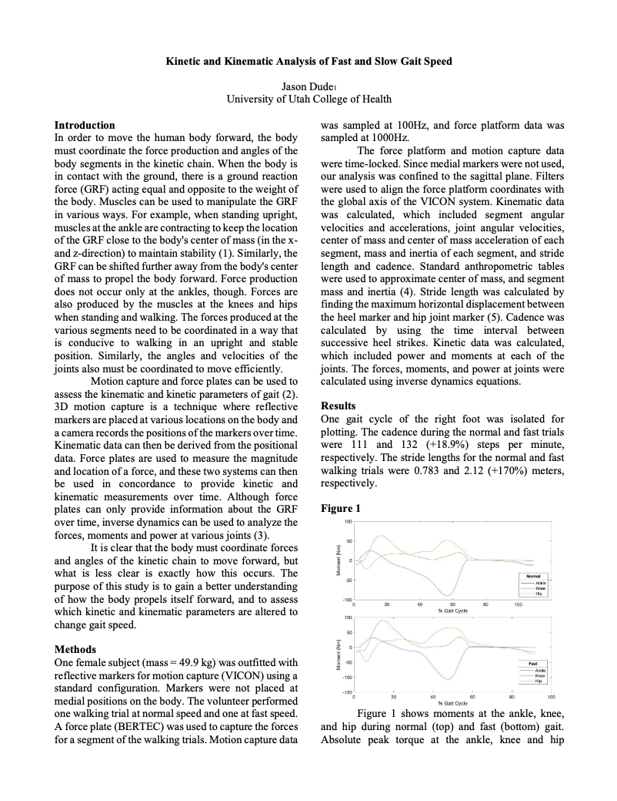

# Inverse Dynamics Analysis
The scripts in this repository calculate inverse dynamics from analog and marker position data. The [jdmodel.m](jdmodel.m) is the main script file. This file loads the data, assigns markers to anatomical joints and calculates segment angular velocities and accelerations, joint angular velocities, center of mass acceleration for each segment, mass and inertia terms, stride length, cadence, and joint power. You can read the lab paper ([Lab03_Jason_Dude.pdf](Lab03_Jason_Dude.pdf)) if you'd like to learn more about the analysis.

